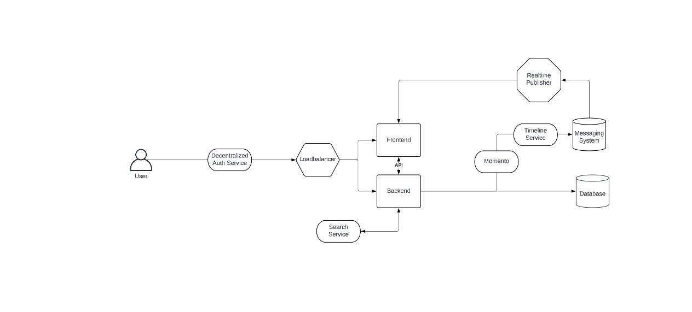
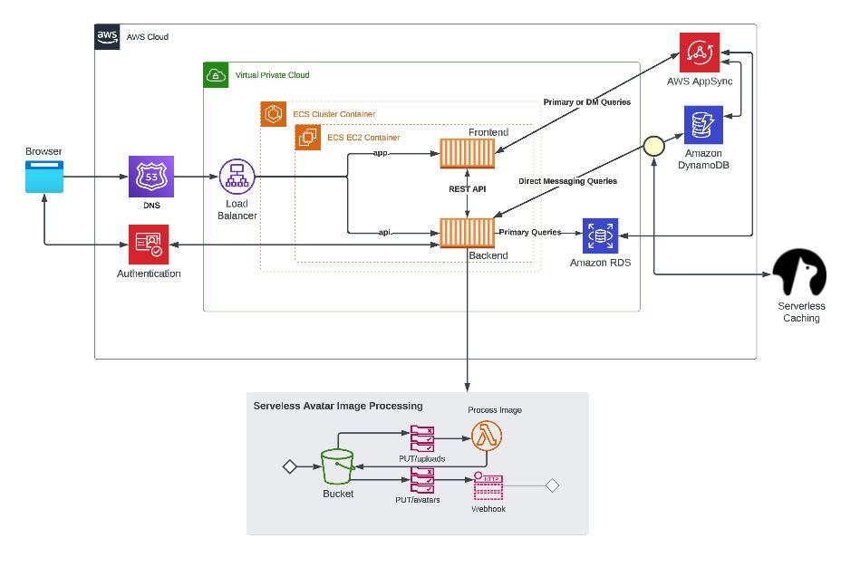
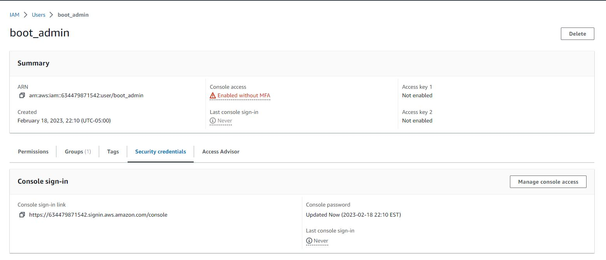
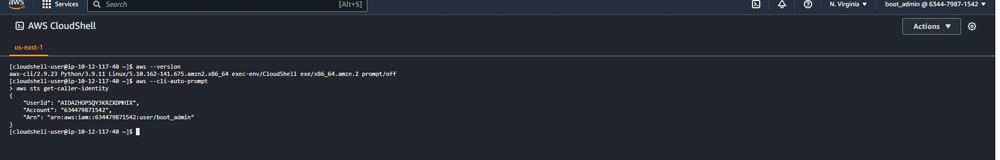
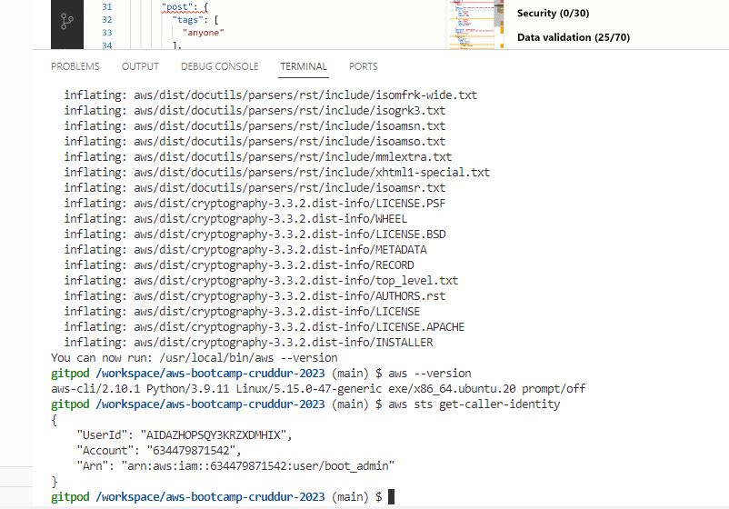
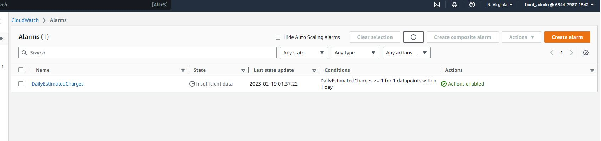
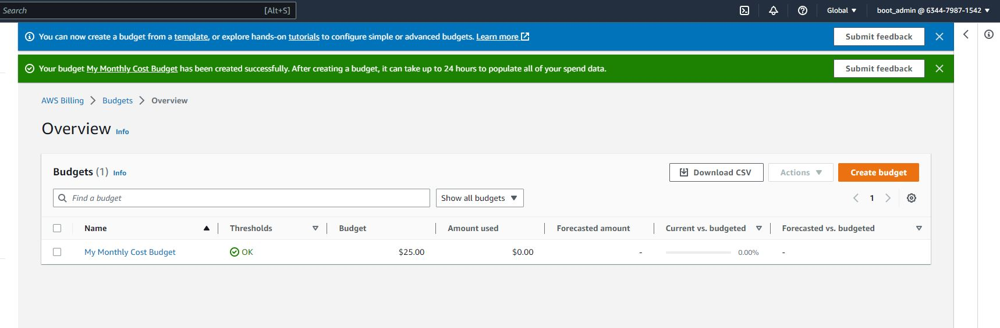
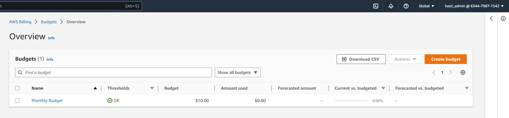

#Week0 - Billing and Architecture

## Required Home Work

### Recreate Conceptual Diagram in Lucid Charts or on a Napkin

[Lucid Chart Shared Link](https://lucid.app/lucidchart/cc09e146-f07c-4142-9f3c-cfc7964766a7/edit?viewport_loc=-772%2C-169%2C2219%2C1032%2C0_0&invitationId=inv_4a736b9a-2783-41f0-929f-92aee0d7e61f)

### Recreate Logical Architectual Diagram in Lucid Charts

[Lucid Chart Shared Link](https://lucid.app/lucidchart/d6319d09-5fff-445b-a717-b901f57db691/edit?viewport_loc=-11%2C-11%2C2219%2C1032%2CGsvyRQib.dyM&invitationId=inv_9bd23b37-b83e-40ab-afe1-2f3647f9b41e)

### Create an Admin User

### Use CloudShell

### Generate AWS Credentials

### Installed AWS CLI

### Create a Billing Alarm

### Create a Budget

## Home work challenges
### I followed the instructions in the videos which are quite concise so I did not have any challenges this time.

## References
### The Videos 

[Live Streamed Video]	(https://www.youtube.com/watch?v=SG8blanhAOg&list=PLBfufR7vyJJ7k25byhRXJldB5AiwgNnWv&index=12)

[Chirag's Week 0 - Spend Considerations]	(https://www.youtube.com/watch?v=OVw3RrlP-sI&list=PLBfufR7vyJJ7k25byhRXJldB5AiwgNnWv&index=13)

[Watched Ashish's Week 0 - Security Considerations]	https://www.youtube.com/watch?v=4EMWBYVggQI&list=PLBfufR7vyJJ7k25byhRXJldB5AiwgNnWv&index=15

[Recreate Logical Diagram in Lucid Charts]	(https://www.youtube.com/watch?v=K6FDrI_tz0k&list=PLBfufR7vyJJ7k25byhRXJldB5AiwgNnWv&index=17)

[Create an Admin User on AWS]	(https://www.youtube.com/watch?v=OdUnNuKylHg&list=PLBfufR7vyJJ7k25byhRXJldB5AiwgNnWv&index=14)

