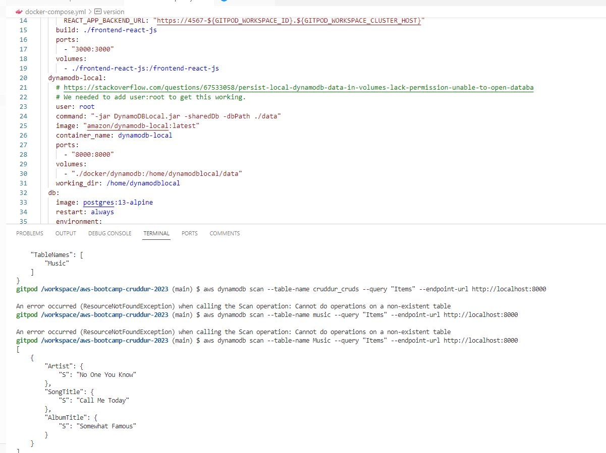

#Week1 - App Containerization

## Required Home Work

### Containerize Application (Docker Files, Docker Compose)

#### Installed the flask package and ran the backend application on the host

#### Accessed the backend app on the web browser

#### Built and ran the container image for the backend app. 

#### Accessed the backend app running in a container on web browser. 

#### Created the docker-compose file to build and run both frontend and backend conatiners. 

#### Accessed the frontend app running in a container on web browser. 

### Created a react page for notifications 

### Running DynamoDB local container, creating a table, inserting item into the table and querying the table

### Running Postgres locally on the host, login to the postgres and running simple queries

## Home work challenges
### Not Available (Updated soon).

## References
### The Videos 
	[Containerize Application (Dockerfiles, Docker Compose)]	(https://www.youtube.com/watch?v=zJnNe5Nv4tE&list=PLBfufR7vyJJ7k25byhRXJldB5AiwgNnWv&index=22)
	[Document the Notification Endpoint for the OpenAI Document, Flask Backend Endpoint for Notifications, React Page for Notifications]	(https://www.youtube.com/watch?v=k-_o0cCpksk&list=PLBfufR7vyJJ7k25byhRXJldB5AiwgNnWv&index=27
	[Run DynamoDB Local Container and Postgres Container and ensure it works]	(https://www.youtube.com/watch?v=CbQNMaa6zTg&list=PLBfufR7vyJJ7k25byhRXJldB5AiwgNnWv&index=28)

